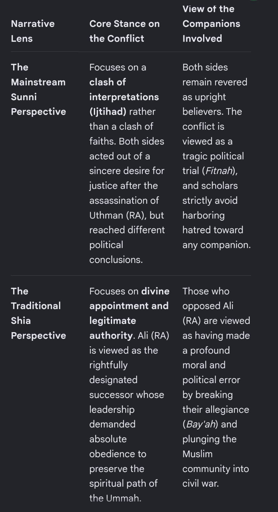
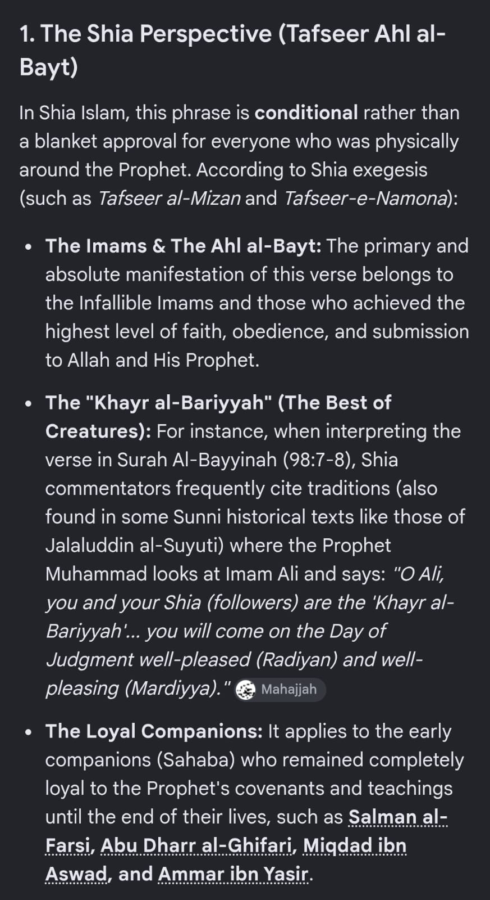
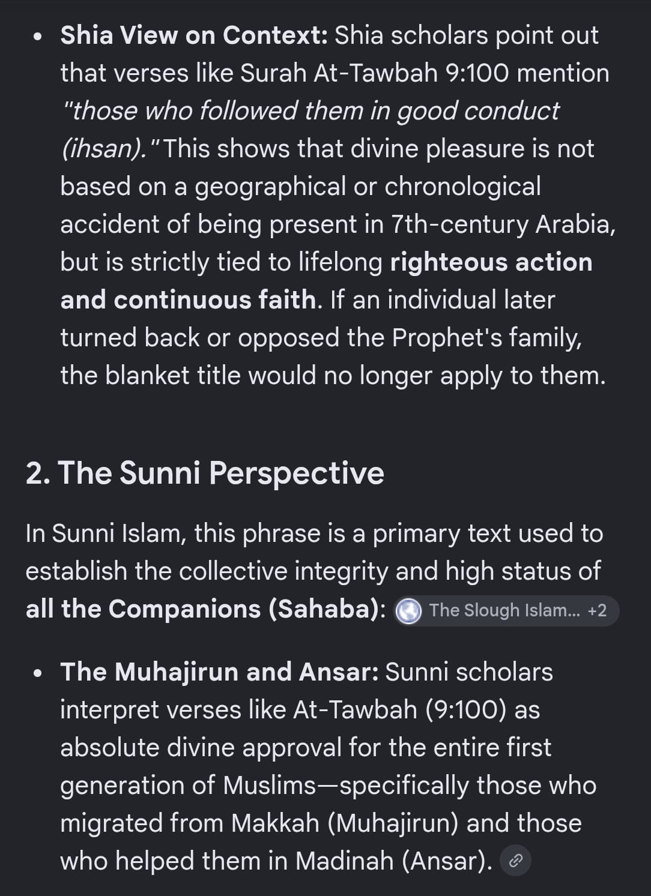
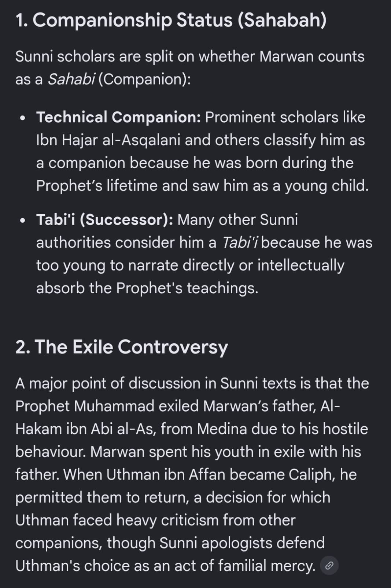
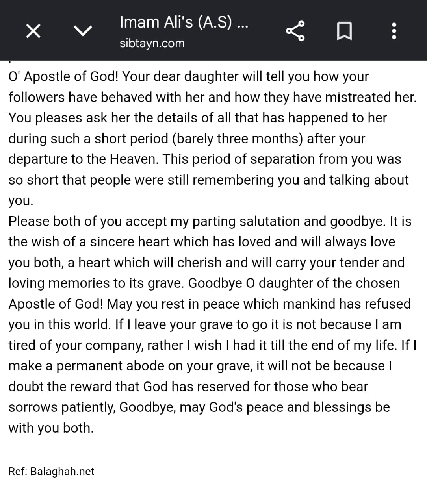
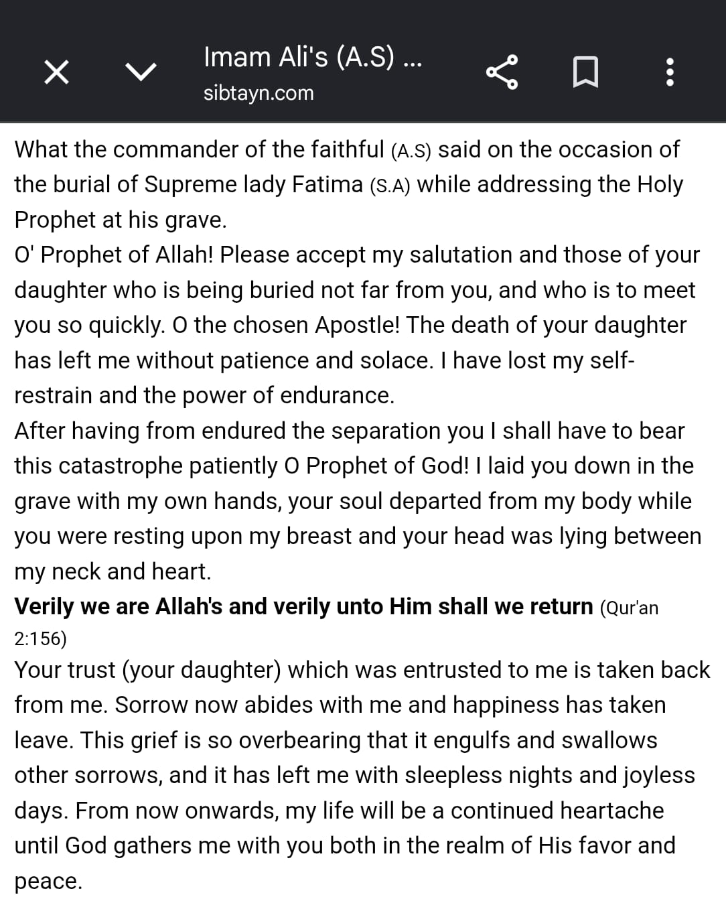

# Raw Source Transcript (Verbatim)

> **This file is the ground truth.** It is an unedited, unabridged conversion
> of the original uploaded document
> (`List of questions composed by Arif bhai.docx`) — a WhatsApp message log
> forwarded by Arif Bhai, in original chronological order, with every link,
> quoted text block, and embedded image preserved exactly as it appeared in
> the source file. Nothing has been reworded, summarized, reordered, or
> removed. The only changes made from the original `.docx` are mechanical:
> Word's escape characters were unescaped for readability, and image files
> were moved to [`images/`](images/) alongside this file.
>
> The [`chapters/`](../chapters/) folder re-organizes this same content by
> topic for readability. Every item in `chapters/` traces back to a specific
> point in this file — see [`../QA-CHECKLIST.md`](../QA-CHECKLIST.md) for the
> line-by-line mapping that verifies nothing was dropped in that
> reorganization. If anything is ever in doubt about wording, a reference, or
> whether something was omitted, this file is the file to check against.

---

\[24/08/2026, 11:59:07 PM\] Arif Bhai: Here's a full list. With references that can be picked up one by one

The main issue with oral narrations is that they differ from person to person.

https://shiapen.com/deception/distortion-in-books-by-sunni-scholars/1-distortion-of-al-haythami-in-a-narration-whee-it-is-mentioned-that-mu-waiyah-took-a-forbidden-drink/

See number \#23

It is alarming

\[25/08/2026, 12:03:02 AM\] Arif Bhai: Couple more links

1\. https://www.reddit.com/r/shia/s/qN46HHTzcY

2\. https://sunnah.com/abudawud:4646

\[25/08/2026, 12:03:03 AM\] Arif Bhai: See translation of last line of link \#2. Shk albani graded it sahih

\[25/08/2026, 12:03:03 AM\] Arif Bhai: So it's not shaz , it's kazab.

\[25/08/2026, 12:05:55 AM\] Arif Bhai: I am forwarding as received. The language used by the person asking may be disturbing but this is expected and we should not take offence but rather be patient and concentrate on our job at hand.

\[25/08/2026, 12:11:03 AM\] Arif Bhai: One sermon of Amir al-mu'minin \`Ali is known as Khutbah ash-Shiqshiqiyyah (the sermon of the Camel's Foam). (Majma\` al-amthal, vol.1, p.369)

Surah 24.55 difference in opinion about khalifa between Shia and Sunni ....The exact text of Ali's sermon in Nahj al-Balagha regarding Umar's proposed expedition

\[25/08/2026, 12:13:37 AM\] Arif Bhai: SayingThat The Qur'an Is Incomplete:

The late Egyptian Muslim scholar Muhammad Abu Zahra said in his book al-Imam al-Sadiq that Muhammad bin Ya'qub al-Kulayni (a hadith recorder, died in 329 AH), recorded in his book "Usul al-Kafi" that the Imam Ja'far al-Sadiq said that the Qur'an which was revealed to the Prophet Muhammad contained seven thousand verses, while the verses we read in the Qur'an are only 6262. The rest is treasured by the members of the House of the Prophet ...

Shaykh Abu Zahra issued a harsh judgment against the hadith recorder al-Kulayni while Shaykh Kulayni is unable to defend himself because he met his Lord centuries ago. In spite of Shaykh Abu Zahra's harsh judgment against al-Kulayni, he did not try to accuse all the Shi'ites with what he accused al-Kulayni.

Al-Kulayni's report concerning the incompleteness of the Qur'an is unacceptable to the Imamite Shi'ites (who are the overwhelming majority of the Shi'ites). They say that the Qur'an is complete without addition, deletion, or change.

Professor Muhammad Abu Zahra in his book Imam al-Sadiq said that al-Safi, a prominent Shi'ite scholar, said in his commentary on the Holy Qur'an the following:

"According to Shaykh Abu Ali al-Tabarsi, another prominent Shi'ite scholar, 'There are no words added to the Qur'an. Any claim of added words is unanimously denied by the Shi'ites. As to the deletion, some Shi'ites and some Sunnis said that there is change or deletion. Our scholars deny that.' "

Sayyid al-Murtada, another prominent Shi'ite scholar, said:

"... our certainty of the completeness of the Qur'an is like our certainty of the existence of countries or major events which are self-evident. Motives and reasons for recording and guarding the Holy Qur'an are numerous, because the Qur'an is a miracle of the Prophethood and the source of Islamic knowledge and religious rule. Their concern with the Qur'an made the Muslim scholars highly efficient concerning its grammar, its reading, and its verses. "

With this unequaled concern, there is no possibility the Qur'an was changed or deleted in some parts. The mercenary writers---who only try to divide Muslims as a service to the hypocrite Muslim governments---should be informed of the following:

\(1\) Al-Kulayni is not an Imam of the Shi'ites. He is only a hadith recorder who reported what was conveyed to him through one or more sources. He did not say that he heard from al-Imam al-Sadiq. He only said that a hadith came to him through some reporters. He did not live during the days of the Imam al-Sadiq. He did not see any of the Imams of the Members of the House of the Prophet.

The Reporters Of The Incompleteness Of The Qur'an From The Sunnis Are Numerous

2\) Al-Kulayni was not the only scholar who reported the incompleteness of the Qur'an. There are many hadith recorders, in the books of Sunni scholars, who reported that the Caliph 'Umar, 'A'ishah, and a number of the companions of the Prophet said that the Qur'an is incomplete.

The Sahih Of Al-Bukhari

Al-Bukhari recorded in his Sahih (authentic), part eight, pages 209-210, that Ibn 'Abbas reported that 'Umar bin al-Khattab said in a discourse which he delivered during the last year of his caliphate:

"Certainly Allah sent Muhammad with the truth, and revealed to him the Book. One of the revelations which came to him was the verse of stoning. We read it and understood it.

"The Messenger of God stoned and we stoned after him. I am concerned that if time goes on, someone may say, 'By God, we do not find the verse of stoning in the Book of God;' thus, the Muslims will deviate by neglecting a commandment the Almighty revealed.

"Stoning is in the Book of God. It is the right punishment for a person who commits adultery if the required witnesses are available, or there was pregnancy without marriage or adultery is admitted."

Again, we used to read in the what we found in the Book of God:

"Do not deny the fatherhood of your fathers in contempt because it is disbelief on your part to be ashamed of the fatherhood of your fathers."

Similar reports were recorded by Imam Ahmad in part one of his Musnad (in the Musnad of 'Umar under the caption of the Hadith al-Saqifah, pages 47 and 55). Ibn Hisham recorded similar things in his Seerah of the Prophet. part 2, page 658 (second printing, 1955).

Sahih (Authentic) Of Muslim

Muslim in the seventh part of his Sahih (commentary of al-Nawawi) in the Book of al-Zakah, about the virtue of being satisfied with whatever God gives and about urging people to have that virtue, pages 139-140, reported that Abu Al-’Aswad reported that his father said:

" Abu Musa Al-’Ash'ari invited the Qur'an readers of Basra. Three hundred readers responded to his invitation. He told them: You are the readers and the choice of the people of Basra. Recite the Qur'an and do not neglect it. Otherwise, a long time may elapse and your hearts will be hardened as the hearts of those who came before you were hardened.

" 'We used to read a chapter from the Qur'an similar to Bara'ah in length and seriousness, but I forgot it. I can remember from that chapter only the following words:

" 'Should a son of Adam own two valleys full of wealth, he would seek a third valley, and nothing would fill Ibn Adam's abdomen but the soil.

" 'We used to read a chapter similar to Musabbihat and I forgot it. I only remember out of it the following:

" 'Oh you who believe, why do you say what you do not do? Thus a testimony will be written on your necks and you will be questioned about it on the Day of Judgment.' "

It is obvious that these words which Abu Musa mentioned are not from the Qur'an, nor are they similar to any of the words of God in the Qur'an. It is amazing that Abu Musa claims that two surahs from the Qur'an are missing, one of them similar to Bara'ah (the chapter of Bara'ah contains 130 verses).

'A'ishah

Muslim also reported in the Book of al-Rida'ah (Book of Nursing), part 10, page 29, that 'A'ishah said the following:

"There was in what was revealed in the Qur'an that ten times of nursing known with certainty makes the nursing woman a mother of a nursed child. This number of nursings would make the woman 'haram' (forbidden) to the child. The this verse was replaced by 'five known nursings' to make the woman forbidden to the child. The Prophet died while these words were recorded and read in the Qur'an."

'Umar Said Chapter 33 Is Incomplete

Al-Muttaqi 'Ali bin Husam al-Din in his book "Mukhtasar Kanz al-'Ummal" printed on the margin of Imam Ahmad's Musnad, part two, page 2, in his hadith about chapter 33, said that Ibn Mardawayh reported that Hudhayfah said:

'Umar said to me 'How many verses are contained in the chapter of al-Ahzab?' I said, '72 or 73 verses.' He said it was almost as long as the chapter of the Cow, which contains 287 verses, and in it there was the verse of stoning.

Mustadrak Al-Sahihayn

Al-Hakim al-Nisaburi in his book al-Mustadrak in the book of commentary on the Qur'an, part two, page 224, reported that Ubay bin Ka'b (whom the Prophet called the leader of al-Ansar), said that the Messenger of God said to him:

"Certainly the Almighty commanded me to read the Qur'an in front of you, and he read 'The unbelievers from the people of the Book and the pagans will not change their way until they see the evidence. Those who disbelieve among the people of the scripture and idolaters could not change until the clear proof came unto them. A Messenger from Allah, reading purified pages ...' "

And of the very excellent part of it "Should Ibn Adam ask for a valley full of wealth and I grant it to him, he would ask for another valley. And if I grant him that, he would ask for a third valley. Nothing would fill the abdomen of Ibn Adam except the soil. God accepts the repentance of anyone who repents. The religion in the eyes of God is the Hanafiyah (Islam) rather than Yahudiyyah (Judaism) or Nasraniyyah (Christianity). Whoever does good, his goodness will not be denied."

Al-Hakim said:

"This is an authentic hadith but the two shaykhs (al-Bukhari and Muslim) did not record it. Al-Dhahabi also considered it authentic in his commentary (on al-Mustadrak)."

Al-Hakim reported also that Ubay Ibn Kabb used to read:

"Those who disbelieved had set up in their hearts the zealotry of the age of ignorance; and if you had had a similar zealotry, the Sacred Mosque would have been corrupted, and God brought down His peace of reassurance upon His Messenger."

When this reading was conveyed to 'Umar, he became very angry with Ubay. He sent for him while he was treating his she-camel with tar. He also invited other companions, including Zayd Ibn Thabit. Ubay came to him. 'Umar asked: "Who among you would read the chapter of al-Fatah (victory)? Zayd Ibn Thabit read the chapter the way we read it now. 'Umar spoke to Ubay angrily. Ubay said 'Shall I speak?' 'Umar said 'Speak out.' Ubay said 'You know that I used to enter the house of the Prophet, and he used to teach me the reading of the Qur'an while you and others were by the door.'"

"If you want me to teach people the way the Prophet taught me, I will teach them; otherwise, I will not teach them one letter ever."

'Umar said to him: "Continue teaching people how to read."

Al-Hakim said this is authentic according to the standards of the two shaykhs (al-Bukhari and Muslim). However, they did not report it.

Al-Dhahabi also considered it authentic in his Commentary on al-Mustadrak, part two, pages 225-226.

If we take the report of Ibn Mardawayh which Hudhayfah attributed to 'Umar in which he said that the chapter of al-Ahzab, which contained 72 verses, was as long as the chapter of the Cow (which contained 287) and take the report of Abu Musa which says that a chapter equal in length to the chapter of Bara'ah (which contains 130 verses) was deleted from the Qur'an, then the deletion in the Qur'an according to these reports would be about 345 verses.

If this is true, what would be the difference between the deletion according to these reports and the report which is attributed to al-Kulayni that claims a deletion of 600 verses?

Furthermore, suppose that al-Kulayni had recorded in his book al-Kafi that some of the Qur'anic verses were deleted. Why should all the Shi'ites be accused of the belief in the incompleteness of the Qur'an? Kulayni is not an Imam of the Shi'ites, and the Shi'ites are not his followers.

Al-Kulayni was no more than a hadith recorder. If a scholar like him makes a mistake, why should we attribute that mistake to the millions of Shi'ites who are not even his followers?

If such an accusation is permissible, why should we not accuse all the Sunnis of the belief in the incompleteness of the Qur'an because they all are followers of 'Umar who was quoted by al-Bukhari, Muslim, Imam Ahmad, and Ibn Mardawayh to have said that the Qur'an was incomplete, and that more than 200 Qur'anic verses were deleted?

Why should the Caliph 'Umar, 'A'ishah, Abu Musa, and Ubay Ibn Ka'b not be accused of the same thing because all of them stated the incompleteness of the Qur'an?

Accusing Muslims of Kufr or deviation is abhorable to God. We have been commanded by the Qur'an and the Prophet to consider anyone who declares that there is no God but Allah and that Muhammad is the Messenger of God to be a Muslim. al-Bukhari reported that 'Abdullah Ibn 'Umar reported that the Messenger of God said:

"When a person calls his Muslim brother a Kafir, one of the two would carry the sin."

We believe that the Qur'an as it is now is the entire Qur'an without addition, subtraction, or change.

It is the Qur'an which no falsehood from the era of pre-revelation or post-revelation entered it. It is a revelation from the Mighty, the Praised.

Allah promised that He will protect the Qur'an. He said

"Certainly We revealed the Reminder (the Holy Qur'an), and certainly We shall preserve it." (15: 9)

It is the Qur'an through which the Messenger and the Members of his House commanded us to test the authenticity of every hadith, and accept the hadith which agrees with the Qur'an and reject the hadith that disagrees with it.

We believe that whoever says that the Qur'an is incomplete, or was added to, or changed, is completely wrong. What was reported on this subject from Caliph 'Umar, Abu Musa, Ubay Ibn Ka'b, al-Bukhari, Imam Ahmad, Muslim, al-Hakim, and al-Kulayni is completely rejected and absolutely unacceptable.

We certainly reject all of these reports, but we will not pass any judgment on any of the above mentioned reporters. Passing judgment belongs only to Allah.

It is hoped that what was offered on this subject is sufficient for those who try to find the truth, that the Shi'ite Muslims are true believers deserving respect from their Sunni brothers. It is unbecoming of those who seek the truth to accuse others of a sin of which they are entirely innocent, especially when the accusers have committed worse than that of which they accuse others.

Finally, I would like to say that al-Kulayni's report concerning the incompleteness of the Qur'an does not indicate that he believed in what he recorded. al-Bukhari, Muslim, Imam Ahmad, and al-Hakim have reported that 'Umar, 'A'ishah, and a number of companions stated that the Qur'an is incomplete. Yet we do not say that these hadith recorders believed in what they recorded.

I am inclined to believe that al-Kulayni did not subscribe to what he reported because he mentioned in his book al-Kafi that all hadith should be tested by the Book of God (the Qur'an). Whatever agrees with the Qur'an should be accepted, and whatever disagrees with the Qur'an should be rejected.

Al-Kulayni mentioned in his introduction to his book the following:

"Brother, may God lead you to the right road. You ought to know that it is impossible for anyone to distinguish the truth from the untruth when Muslim scholars disagree upon statements attributed to the Imams. There is only one way to separate the true from the untrue reports, through the standard which was declared by the Imam:

"'Test the various reports by the Book of God; whatever agrees with it take it, whatever disagrees with it reject it.

"'Take what is agreed upon (by scholars). Certainly the universally accepted should not be doubted. '"

These words indicate that al-Kulayni believed that the Book of God is the Qur'an which we read; otherwise, how can we test the various reports through the Book of God?

At the same time, these words indicate that the reports which indicated the incompleteness of the Qur'an should be rejected because they are in disagreement with the Book of God, which declares:

"Certainly We (the Almighty) have revealed the Reminder (the Qur'an), and We shall preserve it." (15:9)

The Imam said:

"Take the agreed upon, for the agreed upon by the Islamic scholars should not be doubted."

And we know that the Book of God is the one on which all the Islamic scholars agree.

Support us

Important: All content hosted on Al-Islam.org is solely for non-commercial purposes and with the permission of original copyright holders.

Any other use of the hosted content, such as for financial gain, requires express approval from the copyright owners.

About Al-Islam.org

Al-Islam.org - Ahlul Bayt Digital Islamic Library Project

©️ Ahlul Bayt Digital Islamic Library Project 1995-2026

Sulaim bin khais khilali ...book accusing Omar (RA) of murdering Fathima .....Aban bin abi ayas , a liar according to Sahih Muslim, in whose house the former hid from Hajaj bin Yusuf narrates from this book

AI Mode ConversationYou said: is there any sahih hadith that will ali also be there at the house e kausaris there any sahih hadith that will ali also be there at the house e kausar ಕನ್ನಡ Yes, there is a well-known narration transmitted in major Sunni and Shia hadith traditions stating that Ali will not separate from the truth until they both meet the Prophet at the Pond (Hawd / Kausar).The Hadith on Ali and the Pond (Hawd)The Narration: The Prophet Muhammad reportedly said: "Ali is with the truth and the truth is with Ali, and they will not separate until they meet me at the Pond (of Kausar) on the Day of Judgment."Authentication: This tradition is recorded by various classical Sunni traditionists, including Al-Hakim al-Nishaburi in Al-Mustadrak alaa al-Sahihain, where Al-Hakim and Al-Dhahabi evaluated its chain as authentic (Sahih), and it is also referenced by Al-Tabarani and Ibn Asakir.Key Aspects of the NarrationInseparable Bond: The text explicitly binds Ali to the truth (Haqq) up until the arrival at the Hawd (Cistern/Kausar).Connection to the Ahl al-Bayt: Other related traditions, such as variants of the Hadith al-Thaqalayn, mention that the Quran and the Ahl al-Bayt (the Prophet's household) will not separate until they meet the Prophet at the Pond of Al-Kausar.If you would like, I can share more details on:The exact Arabic wording of this narrationHow different hadith master scholars (Muhadditheen) graded the various chains of transmission for this specific reportLet me know how you would like to proceed.مجمع جهانی شیعه شناسیAli (AS) will be the Distributor of Kausar Saqiye Kausar31 Jul 2021 — The Holy Prophet (P.B.U.H) told Ali (A.S) : “O Ali! verily you are the distributor of (the water of) Kausar”. It is related in khisaal of Shaikh Sadooq that ...Serat OnlineAli (a.s.) is with the truth and the truth is with Ali (a.s.) – Introduction4 Dec 2014 — 'Ali is with the truth and the truth is with Ali, the two will not separate until they meet me at the Pond (of Kausar).' Tarikh-e-Baghdad vol. 14 p. 321. Haisam...MahajjahHadith 43: 'Ali is with the truth and the truth is with 'Ali. They will ...Hadith 43: 'Ali is with the truth and the truth is with 'Ali. They will never separate until they both arrive at the Hawd (Cistern) on the Day of Judgment.

\[25/08/2026, 6:00:30 AM\] Arif Bhai: https://youtu.be/0ndRAqM-QGM?si=y8yEmvFlAVPgO-md

\[25/08/2026, 6:00:30 AM\] Arif Bhai: Video:

https://youtu.be/KizDH4o1Ljk?si=7Iia8yueVy-g3D3O

------------ References ------------

1\. Fath al-Bari Sharh Sahih al-Bukhari (Sunni Context)

Kitab / Section: Kitab Fada'il Ashab al-Nabi (Sahaba ki fazeelat)

Jild: Jild 7

Hawala: Safha 382

Sanad: Isay Mutawatir kaha gaya hai, yani iski riwayat ke bohat zyada Turuq aur transmission lines hain.

Matn / Context: Ibn Hajar al-Asqalani tasdeeq karte hain ke Hadith-e-Ghadeer ki bohat zyada transmission lines hain. Har sanad, doosri sanad se mustaqil taur par, kam az kam Sahih ya Hasan ke darje ki hai.

2\. Siyar A'lam al-Nubala (Sunni Context)

Kitab / Section: Hafiz Ibn Shahin ka tazkira

Jild: Jild 16

Hawala: Safha 431

Sanad: Ibn Shahin ki thiqat aur amanat ko bayan kiya gaya hai. Al-Khatib al-Baghdadi ne unhein Thiqat al-Amin yani qabil-e-aitemad aur amanatdar kaha.

Matn / Context: Ibn Shahin ki ilmi fazeelat aur Iraq ke ek numaya muhaddith, yani Sheikh al-Iraq, hone ko bayan karta hai.

3\. Sharh Madhahib Ahl al-Sunnah (Sunni Context)

Musannif: Hafiz Abu Hafs Umar ibn Ahmad ibn Uthman ibn Shahin

Hawala: Safha 103, Hadith No. 87

Sanad: Zayd ibn Arqam aur Al-Bara ibn Azib se riwayat hai. Musannif ne is riwayat ko wazeh taur par Sahih qarar diya hai.

Matn / Context: Yeh riwayat Hazrat Ali ibn Abi Talib ki fazeelat ke section mein hai. Is mein zikr hai ke taqreeban 100 Sahaba, jin mein Ashara Mubashara bhi shamil hain, ne Ghadeer Khum ki is mashhoor aur qabil-e-aitemad riwayat ko naql kiya.

4\. Tafsir al-Quran al-Azim (Sunni Context)

Musannif: Ibn Abi Hatim al-Razi

Jild: Jild 1

Hawala: Safha 14 (Muqaddima) aur Safha 1172

Sanad: Musannif ke mutabiq woh Asahh al-Asaneed, yani sab se zyada sahih asaneed par inhisar karte hain.

Matn / Context: Musannif ne apne muqaddime mein fabricated ya be-bunyad riwayat ko shamil na karne ka iltizam kiya. Surah al-Ma'idah ki Ayat-e-Tabligh ki tafsir ke zail mein riwayat aati hai ke yeh ayat khas taur par Ali ibn Abi Talib ke hawale se nazil hui.

5\. Asbab al-Nuzul (Sunni Context)

Musannif: Al-Wahidi

Hawala: Safha 204, Hadith No. 403

Sanad: Matn mein authentic transmission chain shamil hai.

Matn / Context: Ghadeer Khum ke maqam par ayat ke nuzool ke khaas context ko bayan karta hai.

6\. Shawahid al-Tanzil (Sunni Context)

Musannif: Al-Hakim al-Haskani al-Hanafi

Hawala: Safha 156, Hadith No. 210

Sanad: Abu Sa'id al-Khudri aur Abu Hurairah ke zariye riwayat.

Matn / Context: Is mein zikr hai ke jo shakhs 18 Zul-Hijjah, yani Yaum-e-Ghadeer, ka roza rakhe usay 60 mahino ke rozon ka sawab milta hai. Riwayat mein bayan hai ke Nabi ﷺ ne Ali ibn Abi Talib ke bazu buland karke khutba diya, jiske foran baad ayat "Al-yawma akmaltu lakum dinakum" nazil hui aur Nabi ﷺ ne "Allahu Akbar" farmaya.

7\. Sahih Muslim (Sunni Context)

Hawala: Chapter/Section ka page ya number transcript mein specify nahi hai.

Sanad: Jabir ibn Samura se riwayat.

Matn / Context: Nabi ﷺ ne 12 musalsal leaders, yani Khulafa / Imams, ka zikr farmaya jin par Islam ki quwwat aur izzat qaim hogi. Rawiyat ke mutabiq majlis mein itna shor hua ke woh tamam baat wazeh taur par na sun sake. Unke walid ne wazeh kiya ke Nabi ﷺ ne farmaya tha ke woh sab Quraysh mein se honge.

8\. Sunan Abi Dawud (Sunni Context)

Hawala: Chapter/Section ka page ya number transcript mein specify nahi hai.

Sanad: Jabir ibn Samura se riwayat.

Matn / Context: Sahih Muslim ki riwayat ke parallel hai aur 12 Khulafa ke zariye Islam ki hifazat aur quwwat ka zikr karti hai. Shor aur Takbeer ki wajah se us waqt riwayat ka tamam hissa wazeh taur par sunai nahi diya.

9\. Al-Kafi (Shia Context)

Musannif: Al-Kulayni

Jild: Jild 1

Kitab / Bab: Kitab al-Hujjah, Bab al-Nass ala al-A'immah

Hawala: Hadith No. 6

Sanad: Imam Muhammad al-Baqir se manqool.

Matn / Context: Ek tafseeli riwayat mein bayan hai ke jis tarah Allah Ta'ala ne Nabi ﷺ ke zariye namaz, roza aur Zakat ko tadreejan wajib qarar diya, usi tarah Ghadeer Khum par Gabriel ke zariye Wilayah (Imamat) ke nafaz aur uski taleem ka hukm diya gaya. Riwayat mein Nabi ﷺ ki is tashweesh ka bhi zikr hai ke log unke cousin aur successor ko kis tarah qabool karenge, aur Allah ki taraf se unhein hifazat ki yaqeen-dihani karayi gayi.

\[25/08/2026, 6:01:15 AM\] Arif Bhai: Sahih Muslim hadith 2424 of umm salamah on ahley bayth.... Trying to say that the prophet's wives were not belonging to the ahley bayth.

Hadith on qirthas..... Hazrat Omar not allowing the paper and pen to be brought as required by the prophet.

Muvayia (RA) instructing the imams to curse Ali (RA) during Friday sermons.

Inheritance denied to Fathima ( RAH) and she was angry with Abu Baker Siddique (RA) till she passed away in the light of the prophet (SAW) saying that whoever angers Fathima angers me.

Where are all the ahadith narrated by Imam Jaffer from ahley bayth Why Sunni muslims don't teach from them.

\[25/08/2026, 6:18:59 AM\] Arif Bhai: Ali (RA) will be there with prophet (sallallahu alaihi wasallam) at the haus e kausar. This shows his confirmed status in comparison to others while "some" will be driven away. The word used by prophet ( sallallahu alaihi wasallam) is "ashabi". The allegation is that these were momins ( some sahabas) during the lifetime of the prophet ( sallallahu alaihi wasallam) but went on to become "......" ( I shudder to use any word here as it can be severe).... The possibility of this is also mentioned in many aayaths of the Qur'an.... Aamanu summa kafaru... Also aayaths in Surah Al-Baqarah (2:217)Surah Al-Ma'idah (5:54): Surah Ali 'Imran (3:86-89) etc

\[25/08/2026, 6:21:18 AM\] Arif Bhai: Shaykh Al-Islam Ibn Taymiyah (may Allah have mercy on him) said:

“Scholars who were more knowledgeable than Muslim criticised this Hadith, such as Yahya ibn Ma\`in, Al-Bukhari, and others. Al-Bukhari stated that these were the words of Ka‘b Al-Ahbar. Others regarded it as authentic, such as Abu Bakr ibn Al-Anbari, Abu’l-Faraj ibn Al-Jawzi, and others. Al-Bayhaqi and others agreed with those who regarded it as inauthentic, and this is the correct view, because it was proven through Tawatur reports that Allah created the heavens and the earth and all that is between them in six days, and it is proven that the last of creation occurred on the Friday, which means that the beginning of creation was on the Sunday. This is the view of the People of the Book, and is also indicated by the names of the days of the week (in Arabic, as the word for Sunday may be literally translated as the first day, and so on). This is what is narrated and proven in the Hadiths and other reports.” (End quote from Majmu\` Al-Fatawa, 18/18)

What was affirmed by Shaykh Al-Islam here and elsewhere in his books in more than one place, was also favoured by his student Imam Ibn Al-Qayyim (may Allah have mercy on him), as it says in Al-Manar Al-Munif (85) and by Al-Hafidh Ibn Kathir (may Allah have mercy on him) in his Tafsir (1/215).

That was disputed by Shaykh Al-Mu\`allimi Al-Yamani, Shaykh Al-Albani, and others.

Al-\`Allamah Al-Mu\`allimi (may Allah have mercy on him) said:

“There is nothing in this Hadith to indicate that Allah created anything on the seventh day except Adam, and there is nothing in the Quran to indicate that He created Adam in the first six days; rather this is known to be incorrect.

In the verses at the beginning of Al-Baqarah which speak of the creation of Adam, and in some reports, there is that which may be understood to mean that there were creatures that lived on the earth before Adam, and that lived for a long time. This may support the view that the creation of Adam came much later than the creation of the heavens and the earth.

Think about the verses and the Hadith in the light of this explanation, and it will become clear to you, if Allah wills, that the claim that this Hadith contradicts the apparent meaning of the Quran will be resolved, praise be to Allah.” (End quote from Al-Anwar Al-Kashifah, p. 187-188)

Shaykh Al-Albani (may Allah have mercy on him) said:

“It is not contrary to the Quran in any way whatsoever, in contrast to what some people may think. The Hadith explains how things were created on the face of the earth, and that that happened in seven days. The statement of the Quran, that the creation of the heavens and the earth occurred in six days, is not contrary to that, because it is possible that these six days were something other than the seven days mentioned in the Hadith. It – I mean the Hadith – is speaking of one stage in the development of creation on the face of the earth, until it became fit for habitation. This is supported by the fact that the Quran states that some days with Allah, may He be Exalted, are as a thousand years, and some are as fifty thousand. So why shouldn’t these six days be like that? And the seven days could be like the days that we know, as the Hadith clearly states. In that case there is no contradiction between this Hadith and the Quran.” (End quote from Mishkat Al-Masabih, 3/1597)

\[25/08/2026, 8:16:39 AM\] Arif Bhai: Another question and challenge being raised on the Qur'an is ... Show us the clear hadith where the prophet ( sallallahu alaihi wasallam) says himself that the Qur'an is complete. You say that the Qur'an had 7 ahruf and call it 7 types of recitation which is false. Recitation is qirat which is different and has 10 methods of reciting. So where are the rest 6 of the ahruf gone? Also there are reports that famous sahabas destroyed a number of ahadith also. The claim is that the ahley bayth always recorded the ahadith which are authentic but the sunnis do not study and transmit them.

\[25/08/2026, 8:23:42 AM\] Arif Bhai: Verse 5: 3 ( today I have perfected your religion..) could not have been revealed in Arafah as understood by the sunnis since the other aspects of haj were yet to be done after Arafah like going to muzdalifah, mina, sacrifice, etc upto tawaf e wida. So how is Islam complete without completing one of it's main pillars. So how would you view all the ahadith on this claim?

\[26/08/2026, 6:57:23 AM\] Arif Bhai: New evidence 🧾

Theory about the person behind the first fitnah and that Amma Aisha was just a pawn in this scheme.

\[26/08/2026, 6:57:24 AM\] Arif Bhai: Will be informative to see who propagated (narrator) of the ashara mubashara hadith, and the one about talha being a walking martyr. Also why it's ommited from bukhari and muslim

\[26/08/2026, 2:58:07 PM\] Arif Bhai: Riyad as-Salihin 664 - The Book of Miscellany - كتاب المقدمات - Sunnah.com - Sayings and Teachings of Prophet Muhammad (صلى الله عليه و سلم) https://share.google/0fw33KS14ps6fhIrx

\[26/08/2026, 2:58:07 PM\] Arif Bhai: Note this companion was looking forward to / already planning his actions following prophet pbuh death

\[26/08/2026, 2:58:08 PM\] Arif Bhai: He is said to be the one that betrayed uthman. Then waged war claiming to avenge him

\[26/08/2026, 2:58:08 PM\] Arif Bhai: https://share.google/aimode/EFs69TVMhkQMRfNko

Additional references

https://sunnah.com/abudawud:4646

\[26/08/2026, 2:58:08 PM\] Arif Bhai: From this it appears so that we hasten to the defense of any companion regardless of their wrongdoings. Justice and rulings don't seem to apply to them: all on the basis of one verse. That measures for justice doesn't apply to them, even if they wrong Ali, Fathima, other muslim sahabas, caliphs etc.

\[26/08/2026, 2:58:09 PM\] Arif Bhai: Their tafseer is more accurate with these ahadith

\[26/08/2026, 2:58:10 PM\] Arif Bhai: Sahih al-Bukhari 6582 - To make the Heart Tender (Ar-Riqaq) - كتاب الرقاق - Sunnah.com - Sayings and Teachings of Prophet Muhammad (صلى الله عليه و سلم) https://share.google/fY0FLzhmfwWrU8DTt

Sahih al-Bukhari 6787 - Limits and Punishments set by Allah (Hudood) - كتاب الحدود - Sunnah.com - Sayings and Teachings of Prophet Muhammad (صلى الله عليه و سلم) https://share.google/jhJvdtdpckUs17bw7

\[26/08/2026, 2:58:10 PM\] Arif Bhai: So it's not a blanket rule for all

\[26/08/2026, 9:01:45 PM\] Arif Bhai: To check authenticity.(Quoted from Najh al balagha) \<This message was edited\>

\[26/08/2026, 9:03:18 PM\] Arif Bhai: Is there a narrative that abu bakar was the first to accept islam after khadija? What are the proofs to establish this. Multiple reports say otherwise (Ali before him, & a dozen others)

\[27/08/2026, 8:41:22 AM\] Arif Bhai: Please read the incident on Fadak as mentioned by this sheikh on page 89/90 and compare with the sermon of Fathima (RAH) in masjid e Nabavi. ... Which is authentic?

\[27/08/2026, 10:30:31 AM\] Arif Bhai: The modern salawat is also a bidah created from a propoganda by sunni regime. Why is it that ahl hadith also follow this?

\[27/08/2026, 10:44:40 AM\] Arif Bhai: Proof:

https://share.google/aimode/U7wqo74OC0Stkidul

Takeaways:

\* Qur'an being the original, divine medium , both in written and recitation form. The first word being Iqra\* (not say).

\* The closest to a mass transmitted documented written proof is coinage.

\* The oral transmission of ahadith even with sahih sanad and deemed rijal, can be untrue / shaz.

\* Will be good to look for authentic earliest documented sources, and what was ommitted and hidden from the texts by Imam Bukhari.

Q to self:

Why was it Iqra and not Qul

\[27/08/2026, 12:54:50 PM\] Arif Bhai: https://al-islam.org/

The above website has a lot of info from the Shiyas

\[27/08/2026, 12:58:12 PM\] Arif Bhai: https://al-islam.org/printpdf/book/export/html/27882
