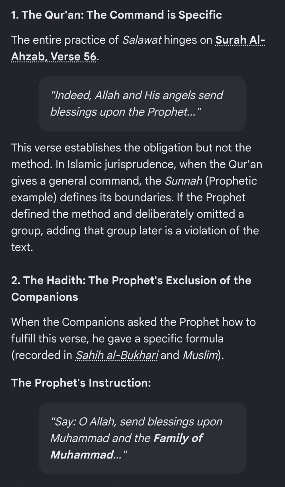
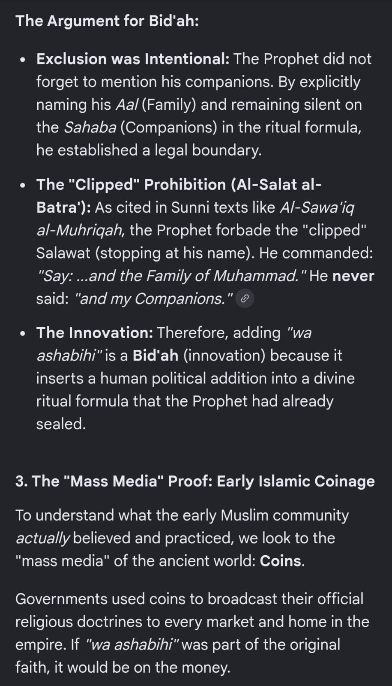

# Chapter 3 — Salah & Worship Practices

Questions about ritual practice — specifically the wording of *Salawat*
(blessings upon the Prophet ﷺ) and whether the commonly used "clipped"
form including the companions is a later addition. All wording is
reproduced verbatim from the source transcript.

---

## 3.1 — Is the modern *Salawat* (including "and his companions") a *bid'ah*? Why do Ahl-e-Hadith also follow it?

**Question (verbatim):**

> The modern salawat is also a bidah created from a propoganda by sunni
> regime. Why is it that ahl hadith also follow this?

**Supporting images (verbatim screenshots, reproduced in full below):**

> **1. The Qur'an: The Command is Specific**
>
> The entire practice of *Salawat* hinges on Surah Al-Ahzab, Verse 56.
>
> > "Indeed, Allah and His angels send blessings upon the Prophet..."
>
> This verse establishes the obligation but not the method. In Islamic
> jurisprudence, when the Qur'an gives a general command, the *Sunnah*
> (Prophetic example) defines its boundaries. If the Prophet defined the
> method and deliberately omitted a group, adding that group later is a
> violation of the text.
>
> **2. The Hadith: The Prophet's Exclusion of the Companions**
>
> When the Companions asked the Prophet how to fulfill this verse, he gave
> a specific formula (recorded in *Sahih al-Bukhari* and *Muslim*).
>
> **The Prophet's Instruction:**
>
> > "Say: O Allah, send blessings upon Muhammad and the **Family of
> > Muhammad**..."

> **The Argument for Bid'ah:**
>
> - **Exclusion was Intentional:** The Prophet did not forget to mention
>   his companions. By explicitly naming his *Aal* (Family) and remaining
>   silent on the *Sahaba* (Companions) in the ritual formula, he
>   established a legal boundary.
> - **The "Clipped" Prohibition (Al-Salat al-Batra'):** As cited in Sunni
>   texts like *Al-Sawa'iq al-Muhriqah*, the Prophet forbade the "clipped"
>   Salawat (stopping at his name). He commanded: "Say: ...and the Family
>   of Muhammad." He never said: "and my Companions."
> - **The Innovation:** Therefore, adding "wa ashabihi" is a **Bid'ah**
>   (innovation) because it inserts a human political addition into a
>   divine ritual formula that the Prophet had already sealed.
>
> **3. The "Mass Media" Proof: Early Islamic Coinage**
>
> To understand what the early Muslim community *actually* believed and
> practiced, we look to the "mass media" of the ancient world: Coins.
>
> Governments used coins to broadcast their official religious doctrines
> to every market and home in the empire. If "wa ashabihi" was part of the
> original faith, it would be on the money.

**Source:** `raw-transcript.md`, message timestamped **27/08/2026, 10:30:31 AM**, with images
`image4.png` and `image3.png` (see
[`../source/images/`](../source/images/)).
