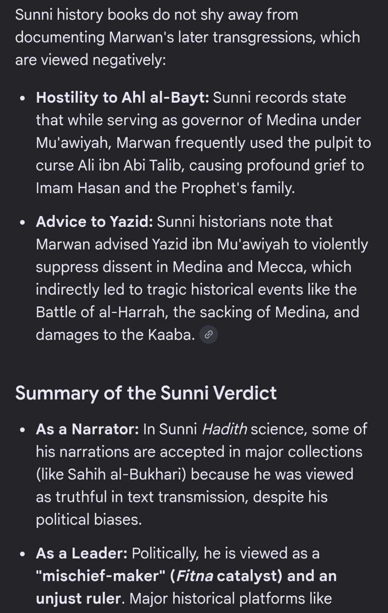

# Chapter 4 — Sahaba (Companions) & Disputes Between Companions

Questions about the conduct, status, and reliability as narrators of
specific companions, and whether "justice" is applied evenly to all of
them. All wording is reproduced verbatim from the source transcript.

---

## 4.1 — Is a narration graded *sahih* by chain still reliable if its content looks false? (The Muawiyah forbidden-drink narration)

**Opening framing (verbatim):**

> Here's a full list. With references that can be picked up one by one
>
> The main issue with oral narrations is that they differ from person to
> person.
>
> https://shiapen.com/deception/distortion-in-books-by-sunni-scholars/1-distortion-of-al-haythami-in-a-narration-whee-it-is-mentioned-that-mu-waiyah-took-a-forbidden-drink/
>
> See number #23
>
> It is alarming

**Follow-up (verbatim):**

> Couple more links
>
> 1. https://www.reddit.com/r/shia/s/qN46HHTzcY
> 2. https://sunnah.com/abudawud:4646
>
> See translation of last line of link #2. Shk albani graded it sahih
>
> So it's not shaz, it's kazab.

**Editorial note that accompanied this material (verbatim, preserved as
important context on how this whole compilation should be read):**

> I am forwarding as received. The language used by the person asking may
> be disturbing but this is expected and we should not take offence but
> rather be patient and concentrate on our job at hand.

**Source:** `raw-transcript.md`, messages timestamped **24/08/2026, 11:59:07 PM**
through **25/08/2026, 12:05:55 AM**.

*See also: [Chapter 2, §2.3](02-sunnah-and-hadith-authenticity.md) for why
this is filed as a hadith-methodology question too.*

---

## 4.2 — Why did Umar not allow paper and pen to be brought to the Prophet ﷺ as he requested? (Hadith of Qirtas)

**Question (verbatim, from a combined message list — see also §4.3, §2.2, and §5.1–§5.2 for the other items in the same list):**

> Hadith on qirthas..... Hazrat Omar not allowing the paper and pen to be
> brought as required by the prophet.

**Source:** `raw-transcript.md`, message timestamped **25/08/2026, 6:01:15 AM**.

---

## 4.3 — Why did Muawiyah instruct governors/imams to curse Ali during Friday sermons?

**Question (verbatim, from the same combined message list as §4.2):**

> Muvayia (RA) instructing the imams to curse Ali (RA) during Friday
> sermons.

**Source:** `raw-transcript.md`, message timestamped **25/08/2026, 6:01:15 AM**.

*See also: §4.9 ("Marwan: a case study in whether justice applies evenly
to companions") below — Marwan (Muawiyah's governor of Medina) is
separately documented in Sunni sources as having cursed Ali from the
pulpit.*

---

## 4.4 — Who propagated the *ashara mubashara* hadith, and the one about Talha being a "walking martyr"? And why is it omitted from Bukhari and Muslim?

**Question (verbatim):**

> New evidence 🧾
>
> Theory about the person behind the first fitnah and that Amma Aisha was
> just a pawn in this scheme.
>
> Will be informative to see who propagated (narrator) of the ashara
> mubashara hadith, and the one about talha being a walking martyr. Also
> why it's ommited from bukhari and muslim

**Supporting image (verbatim screenshot):**

> | Narrative Lens | Core Stance on the Conflict | View of the Companions Involved |
> |---|---|---|
> | **The Mainstream Sunni Perspective** | Focuses on a clash of interpretations (*Ijtihad*) rather than a clash of faiths. Both sides acted out of a sincere desire for justice after the assassination of Uthman (RA), but reached different political conclusions. | Both sides remain revered as upright believers. The conflict is viewed as a tragic political trial (*Fitnah*), and scholars strictly avoid harboring hatred toward any companion. |
> | **The Traditional Shia Perspective** | Focuses on divine appointment and legitimate authority. Ali (RA) is viewed as the rightfully designated successor whose leadership demanded absolute obedience to preserve the spiritual path of the Ummah. | Those who opposed Ali (RA) are viewed as having made a profound moral and political error by breaking their allegiance (*Bay'ah*) and plunging the Muslim community into civil war. |

**Source:** `raw-transcript.md`, messages timestamped **26/08/2026, 6:57:23 AM**
and **6:57:24 AM**, with image `image5.png`.

---

## 4.5 — Some of the Prophet's "*ashabi*" (companions) will be driven away at the Pool of Kawthar — how does this square with a blanket claim that all companions are just?

**Question (verbatim):**

> Ali (RA) will be there with prophet (sallallahu alaihi wasallam) at the
> haus e kausar. This shows his confirmed status in comparison to others
> while "some" will be driven away. The word used by prophet (sallallahu
> alaihi wasallam) is "ashabi". The allegation is that these were momins
> (some sahabas) during the lifetime of the prophet (sallallahu alaihi
> wasallam) but went on to become "......" (I shudder to use any word here
> as it can be severe).... The possibility of this is also mentioned in
> many aayaths of the Qur'an.... Aamanu summa kafaru... Also aayaths in
> Surah Al-Baqarah (2:217) Surah Al-Ma'idah (5:54): Surah Ali 'Imran
> (3:86-89) etc

**Related reference material (Ali and the Pool of Kawthar — from an "AI
Mode" conversation forwarded as part of the same research thread,
reproduced verbatim):**

> is there any sahih hadith that will ali also be there at the house e
> kausar
>
> Yes, there is a well-known narration transmitted in major Sunni and Shia
> hadith traditions stating that Ali will not separate from the truth
> until they both meet the Prophet at the Pond (Hawd / Kausar).
>
> **The Hadith on Ali and the Pond (Hawd)**
>
> The Narration: The Prophet Muhammad reportedly said: "Ali is with the
> truth and the truth is with Ali, and they will not separate until they
> meet me at the Pond (of Kausar) on the Day of Judgment."
>
> Authentication: This tradition is recorded by various classical Sunni
> traditionists, including Al-Hakim al-Nishaburi in Al-Mustadrak alaa
> al-Sahihain, where Al-Hakim and Al-Dhahabi evaluated its chain as
> authentic (Sahih), and it is also referenced by Al-Tabarani and Ibn
> Asakir.
>
> Key Aspects of the Narration: Inseparable Bond — the text explicitly
> binds Ali to the truth (Haqq) up until the arrival at the Hawd
> (Cistern/Kausar). Connection to the Ahl al-Bayt — other related
> traditions, such as variants of the Hadith al-Thaqalayn, mention that
> the Quran and the Ahl al-Bayt (the Prophet's household) will not
> separate until they meet the Prophet at the Pond of Al-Kausar.
>
> Additional citations gathered in the same thread: "Ali (AS) will be the
> Distributor of Kausar" (Saqiye Kausar, citing Khisaal of Shaikh Sadooq) —
> "The Holy Prophet (P.B.U.H) told Ali (A.S): 'O Ali! verily you are the
> distributor of (the water of) Kausar'"; and "'Ali is with the truth and
> the truth is with Ali, the two will not separate until they meet me at
> the Pond (of Kausar).' Tarikh-e-Baghdad vol. 14 p. 321"; and Mahajjah,
> Hadith 43: "'Ali is with the truth and the truth is with 'Ali. They will
> never separate until they both arrive at the Hawd (Cistern) on the Day
> of Judgment."

**Later, directly related reference links (verbatim):**

> Sahih al-Bukhari 6582 - To make the Heart Tender (Ar-Riqaq) -
> Sunnah.com - Sayings and Teachings of Prophet Muhammad (ﷺ)
> https://share.google/fY0FLzhmfwWrU8DTt
>
> Sahih al-Bukhari 6787 - Limits and Punishments set by Allah (Hudood) -
> Sunnah.com - Sayings and Teachings of Prophet Muhammad (ﷺ)
> https://share.google/jhJvdtdpckUs17bw7

**Source:** `raw-transcript.md`, message timestamped **25/08/2026, 6:18:59 AM**
(main question), an untimestamped "AI Mode Conversation" block that
precedes it in the source (immediately after the Qur'an-completeness essay,
before the **25/08/2026, 6:00:30 AM** video messages), and the
**26/08/2026, 2:58:10 PM** Bukhari links.

---

## 4.6 — Was Aisha a pawn of someone else behind the first fitnah?

**Question (verbatim — reproduced in full at §4.4 above, since it was sent
as a single message alongside the ashara mubashara/Talha question):**

> New evidence 🧾
>
> Theory about the person behind the first fitnah and that Amma Aisha was
> just a pawn in this scheme.

**Source:** `raw-transcript.md`, message timestamped **26/08/2026, 6:57:23 AM**.
Full text and supporting image at §4.4 above.

---

## 4.7 — Which companion was "already planning his actions" following the Prophet's ﷺ death, and is it true he betrayed Uthman and then waged war claiming to avenge him?

**Question and notes (verbatim — the source does not further name the
companion beyond this description; nothing has been added or inferred
here):**

> Riyad as-Salihin 664 - The Book of Miscellany - كتاب المقدمات -
> Sunnah.com - Sayings and Teachings of Prophet Muhammad (ﷺ)
> https://share.google/0fw33KS14ps6fhIrx
>
> Note this companion was looking forward to / already planning his
> actions following prophet pbuh death
>
> He is said to be the one that betrayed uthman. Then waged war claiming
> to avenge him
>
> https://share.google/aimode/EFs69TVMhkQMRfNko
>
> Additional references
>
> https://sunnah.com/abudawud:4646

**Source:** `raw-transcript.md`, messages timestamped **26/08/2026, 2:58:07 PM**
and **2:58:08 PM**.

---

## 4.8 — If Qur'an 9:100 grants blanket approval to "the Companions," why do Sunni and Shia tafsir differ on who it actually covers — and does "justice" apply evenly to all companions regardless of wrongdoing?

**Question (verbatim):**

> From this it appears so that we hasten to the defense of any companion
> regardless of their wrongdoings. Justice and rulings don't seem to apply
> to them: all on the basis of one verse. That measures for justice
> doesn't apply to them, even if they wrong Ali, Fathima, other muslim
> sahabas, caliphs etc.
>
> Their tafseer is more accurate with these ahadith

**Supporting images (verbatim screenshots — Shia and Sunni tafsir of
Surah al-Bayyinah 98:7–8 and Surah at-Tawbah 9:100):**

> **1. The Shia Perspective (Tafseer Ahl al-Bayt)**
>
> In Shia Islam, this phrase is **conditional** rather than a blanket
> approval for everyone who was physically around the Prophet. According
> to Shia exegesis (such as *Tafseer al-Mizan* and *Tafseer-e-Namona*):
>
> - **The Imams & The Ahl al-Bayt:** The primary and absolute manifestation
>   of this verse belongs to the Infallible Imams and those who achieved
>   the highest level of faith, obedience, and submission to Allah and His
>   Prophet.
> - **The "Khayr al-Bariyyah" (The Best of Creatures):** For instance, when
>   interpreting the verse in Surah Al-Bayyinah (98:7-8), Shia commentators
>   frequently cite traditions (also found in some Sunni historical texts
>   like those of Jalaluddin al-Suyuti) where the Prophet Muhammad looks at
>   Imam Ali and says: "O Ali, you and your Shia (followers) are the
>   'Khayr al-Bariyyah'... you will come on the Day of Judgment
>   well-pleased (Radiyan) and well-pleasing (Mardiyya)." (Mahajjah)
> - **The Loyal Companions:** It applies to the early companions (Sahaba)
>   who remained completely loyal to the Prophet's covenants and teachings
>   until the end of their lives, such as Salman al-Farsi, Abu Dharr
>   al-Ghifari, Miqdad ibn Aswad, and Ammar ibn Yasir.

> - **Shia View on Context:** Shia scholars point out that verses like
>   Surah At-Tawbah 9:100 mention "those who followed them in good conduct
>   (ihsan)." This shows that divine pleasure is not based on a
>   geographical or chronological accident of being present in
>   7th-century Arabia, but is strictly tied to lifelong righteous action
>   and continuous faith. If an individual later turned back or opposed
>   the Prophet's family, the blanket title would no longer apply to them.
>
> **2. The Sunni Perspective**
>
> In Sunni Islam, this phrase is a primary text used to establish the
> collective integrity and high status of all the Companions (Sahaba):
>
> - **The Muhajirun and Ansar:** Sunni scholars interpret verses like
>   At-Tawbah (9:100) as absolute divine approval for the entire first
>   generation of Muslims — specifically those who migrated from Makkah
>   (Muhajirun) and those who helped them in Madinah (Ansar).

**Source:** `raw-transcript.md`, messages timestamped **26/08/2026, 2:58:08 PM**
and **2:58:09 PM**, with images `image7.png` and `image6.png`.

---

## 4.9 — Marwan: a case study in whether justice applies evenly to companions

**Framing statement (verbatim, immediately following the tafsir images
above and the Bukhari 6582/6787 references in §4.5):**

> So it's not a blanket rule for all

**Supporting images (verbatim screenshots — Marwan ibn al-Hakam's
companionship status and later record):**

> **1. Companionship Status (Sahabah)**
>
> Sunni scholars are split on whether Marwan counts as a *Sahabi*
> (Companion):
>
> - **Technical Companion:** Prominent scholars like Ibn Hajar al-Asqalani
>   and others classify him as a companion because he was born during the
>   Prophet's lifetime and saw him as a young child.
> - **Tabi'i (Successor):** Many other Sunni authorities consider him a
>   *Tabi'i* because he was too young to narrate directly or intellectually
>   absorb the Prophet's teachings.
>
> **2. The Exile Controversy**
>
> A major point of discussion in Sunni texts is that the Prophet Muhammad
> exiled Marwan's father, Al-Hakam ibn Abi al-As, from Medina due to his
> hostile behaviour. Marwan spent his youth in exile with his father. When
> Uthman ibn Affan became Caliph, he permitted them to return, a decision
> for which Uthman faced heavy criticism from other companions, though
> Sunni apologists defend Uthman's choice as an act of familial mercy.

> Sunni history books do not shy away from documenting Marwan's later
> transgressions, which are viewed negatively:
>
> - **Hostility to Ahl al-Bayt:** Sunni records state that while serving
>   as governor of Medina under Mu'awiyah, Marwan frequently used the
>   pulpit to curse Ali ibn Abi Talib, causing profound grief to Imam
>   Hasan and the Prophet's family.
> - **Advice to Yazid:** Sunni historians note that Marwan advised Yazid
>   ibn Mu'awiyah to violently suppress dissent in Medina and Mecca, which
>   indirectly led to tragic historical events like the Battle of
>   al-Harrah, the sacking of Medina, and damages to the Kaaba.
>
> **Summary of the Sunni Verdict**
>
> - **As a Narrator:** In Sunni Hadith science, some of his narrations are
>   accepted in major collections (like Sahih al-Bukhari) because he was
>   viewed as truthful in text transmission, despite his political biases.
> - **As a Leader:** Politically, he is viewed as a "mischief-maker"
>   (Fitna catalyst) and an unjust ruler. Major historical platforms
>   *[screenshot cuts off here — this is the full extent of the captured
>   text]*.

**Source:** `raw-transcript.md`, message timestamped **26/08/2026, 2:58:10 PM**,
with images `image9.png` and `image8.png`.

---

## 4.10 — Is there a reliable narrative that Abu Bakr was the first to accept Islam after Khadija? What proves this, given multiple reports say otherwise?

**Question (verbatim):**

> Is there a narrative that abu bakar was the first to accept islam after
> khadija? What are the proofs to establish this. Multiple reports say
> otherwise (Ali before him, & a dozen others)

**Source:** `raw-transcript.md`, message timestamped **26/08/2026, 9:03:18 PM**.
(Immediately preceded by an edited note: "To check authenticity. (Quoted
from Najh al balagha) `<This message was edited>`" — timestamped 9:01:45 PM,
which relates to the Fatima's-grave sermon in
[Chapter 5, §5.4](05-ahlul-bayt-fatima-and-fadak.md).)
